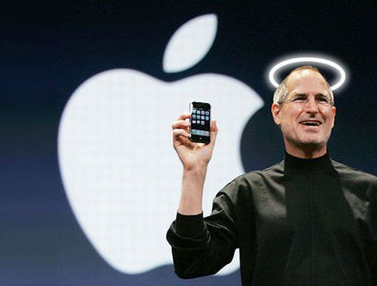

## What is the Halo Effect?

The halo effect is a cognitive bias where one positive impression about a person, product, or brand makes us assume everything else about them is also positive. One strong signal spreads across everything else, like a soft glow around the original good thing. That glow is the halo.

It happens because our brains are a little lazy. We don't want to evaluate every small detail from scratch every single time, so we pick up one strong signal and let it do most of the thinking for us.

A simple example — you walk into a restaurant for the first time. The menu looks lovely, the lighting is warm, the waiter smiles and pulls out the chair for you. You haven't tasted a single dish yet, but somewhere in your head you've already decided the food here is going to be good. That's the halo effect in action.

## Where Does the Halo Effect Come From?

The term was introduced in 1920 by an American psychologist named Edward Thorndike. He was studying how army officers rated their soldiers, and he noticed something odd — officers were rating soldiers either *high* or *low* across almost every single trait. Discipline, intelligence, leadership, physical fitness — all of it bunched together.

It looked like soldiers were either good at everything or bad at everything. But that wasn't really true. What was actually happening was simpler. One strong impression about a soldier was bleeding into how the officer judged everything else about them.

That's the original definition of the halo effect — one trait shapes how we judge all the other traits. Sounds small, but it shows up everywhere.

## How Does the Halo Effect Work in Branding?

In branding, the halo effect works by letting one strong, visible quality of a brand shape how people feel about everything else the brand does. A great product, a memorable logo, a thoughtful website, or even a good first interaction can create a halo that carries across categories the customer hasn't even tried yet.

This is why brands invest so much in *one* hero touchpoint — they know that getting it right will quietly raise the perception of everything else around it.

Three Indian examples make this very clear.

**Apple -** Someone buys an iPhone, and suddenly they're not just thinking *this is a nice phone*. They're thinking the AirPods must be great, the MacBook must be the best laptop out there, even the Apple Store experience must be top-class. Most of them have not actually tried half of those products. But the iPhone built such a strong impression that the glow spread to everything else with the Apple logo on it.

**Tata -** The name itself carries weight in this country. When Tata launched salt, people bought it partly *because* it said Tata. Same when they got into airlines, watches, coffee. Decades of trust in one part of the group quietly created a halo over every new category they entered. New product, same trust.

**Zomato -** Their social media has personality — funny, sharp, weirdly human for a corporate handle. That voice makes people feel like the whole company is more likeable. Even when your delivery is twenty minutes late, the brand voice somehow softens the irritation. That's a halo built entirely from how they talk.

> The product can be average. But if the brand feels right, people will give it the benefit of the doubt.

## Why Does the Halo Effect Matter for Small Businesses?

The halo effect matters more for small businesses than for big ones, because small businesses don't have the budget to be impressive everywhere. They need to be impressive in *one or two places* and let the halo do the rest.

Your website is usually the first thing someone sees. If it looks clean and thoughtful, people assume your work is also clean and thoughtful — even before they read a word. If it looks cluttered or outdated, they quietly question your attention to detail, even when your actual service is excellent. That judgment happens in the first few seconds, and it's very hard to undo later.

The same logic applies to your logo, your packaging, the way you write Instagram captions, your email signature. These tiny things are creating impressions all the time. And those impressions stick longer than you'd think.

Pricing works the same way. A higher price often creates a halo of quality on its own. People assume something costlier must be better, even before they've tried it. It's not always fair, but that's how perception works.

## How Can You Use the Halo Effect for Your Brand?

You can use the halo effect by picking one or two touchpoints and making them genuinely impressive — instead of trying to do everything reasonably well. Here's what creates a strong halo for a small business:

- **A website that looks like you care about the details.** Even one well-designed page can shift how people perceive you across everything else.
- **One piece of work in public that is genuinely well done.** A sharp case study, a thoughtful post, a beautifully made pitch deck. Anything you can point to.
- **Consistency in how you talk across every place you show up.** Instagram, LinkedIn, email, in person — same voice everywhere.
- **A name and logo that feel intentional.** Not slapped together, not following a trend, just thought through.

You don't have to win at all of these. Pick the ones that suit you and do them really well. The glow will carry across the rest.

## Can the Halo Effect Work Against You?

Yes — the halo effect can also work in reverse, creating a *negative* halo. One rude reply on Instagram, one broken link on your website, one typo in a client proposal. People take that one bad signal and assume everything else about you must be a bit careless too. This is sometimes called the *horn effect*, and it's just as powerful as the positive version.

So protecting the small things matters. The little stuff is rarely little.

## The Takeaway

The halo effect isn't a trick or a manipulation tactic. It's how people are wired. We make fast judgments, we use signals, and we form opinions much earlier than we'd like to admit.

As a studio, we think about this almost every day. Every design choice, every word on a website, every Reel we put out — it's all building an impression. And that impression is doing quiet work in someone's head even when we're nowhere in the room.

So the real question isn't *is my product good*. It's *what does my first impression say about me*?

Get that part right. The halo will follow.
